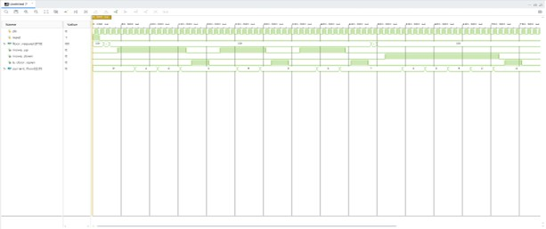
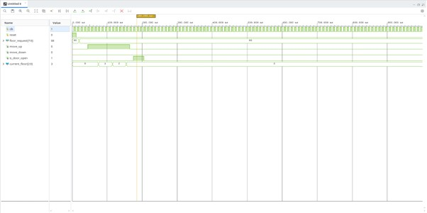
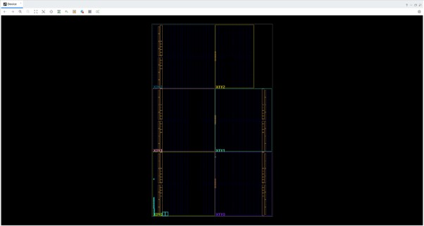
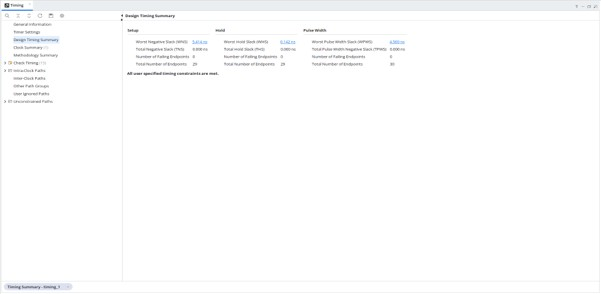

# Elevator Controller in Verilog

I built this 8-floor elevator controller to practise designing an FSM in Verilog and taking an RTL project through simulation, synthesis, and implementation in Vivado.

The controller stores floor requests, travels toward requested floors, stops when it reaches one, and opens the door for a set time. It also detects a new button press, so holding a button does not repeatedly add the same request.

**Design:** `elevator_controller.v`  
**Testbench:** `elevator_controller_tb.v`  
**Timing constraint:** `Timing_constraints.xdc`  
**Tool and target:** Vivado 2026.1, Artix-7

The default design has 8 floors. `N`, `Travel_Cycle`, and `Open_Door_cycle` can be changed in the module parameters. Floor 0 is the starting floor, and each bit of `floor_request` represents one floor.

**Simulation**

I tested requests at multiple floors and checked how the elevator moves between them. I also tested a button held high to check that it is treated as one press.

**Implementation**

The `Images` folder contains the simulation console, synthesized schematic, FPGA device views, resource utilization, timing summary, and power analysis screenshots.

To run the project, add the Verilog files and XDC constraint to a Vivado project. Set `elevator_controller_tb` as the simulation top for behavioral simulation.
